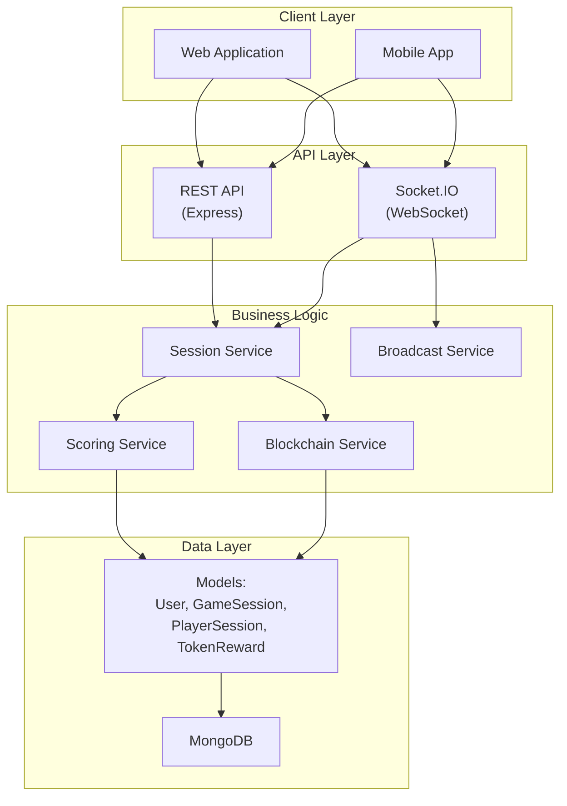

# Socket-Based Game Session System

A real-time game session management system built with Node.js, Express, and Socket.IO that allows players to join sessions, compete in real-time, and receive blockchain token rewards.

## Table of Contents

- [Overview](#overview)
- [Features](#features)
- [Architecture](#architecture)
- [Prerequisites](#prerequisites)
- [Installation & Setup](#installation--setup)
- [Configuration](#configuration)
- [Quick Start](#quick-start)
- [API Documentation](#api-documentation)
- [Socket.IO Documentation](#socketio-documentation)
- [Project Structure](#project-structure)
- [Testing](#testing)
- [Deployment](#deployment)
- [Troubleshooting](#troubleshooting)
- [Contributing](#contributing)
- [License](#license)

## Overview

This system enables players to:
- Register with unique identifiers (username and wallet address)
- Create and join time-bound game sessions
- Receive real-time updates via WebSocket
- Compete and update scores in real-time
- Receive blockchain token rewards at session end

## Features

### Functional Requirements
- ✅ **User Registration** - Register with unique username and wallet address
- ✅ **Session Management** - Create, join, leave, and manage game sessions
- ✅ **Real-time Communication** - Socket.IO for simultaneous data broadcasting
- ✅ **Result Computation** - Calculate winners based on points, tasks, random, or combined criteria
- ✅ **Token Rewards** - Award blockchain tokens to session winners

### Non-Functional Requirements
- ✅ **Scalability** - Room-based broadcasting, efficient database queries, connection pooling
- ✅ **Security** - JWT authentication, input validation, secure error handling
- ✅ **Performance** - Low-latency broadcasts, optimized indexes, efficient session management

## Architecture

### System Architecture



### Component Descriptions

- **REST API**: Express.js server handling HTTP requests
- **Socket.IO**: Real-time WebSocket communication
- **Session Service**: Business logic for session management
- **Scoring Service**: Winner calculation based on different criteria
- **Blockchain Service**: Token reward distribution (mock/real)
- **Broadcast Service**: Centralized real-time broadcasting
- **Models**: MongoDB schemas for data persistence

### Data Flow

1. **User Registration** → Client registers → Server creates User → Returns JWT token
2. **Session Creation** → Client creates session → Server creates GameSession → Returns session data
3. **Join Session** → Client joins → Server creates PlayerSession → Updates GameSession → Auto-starts if ready
4. **Real-time Updates** → Client updates score via Socket → Server updates PlayerSession → Broadcasts to all players
5. **Session End** → Auto-end or manual end → Calculate winner → Award token → Broadcast events

## Prerequisites

- **Node.js**: v14.0.0 or higher (check `.nvmrc` for recommended version)
- **MongoDB**: v4.4 or higher
- **npm**: v6.0.0 or higher

## Installation & Setup

### 1. Clone the Repository

```bash
git clone <repository-url>
cd nalikes-task-backend
```

### 2. Install Dependencies

```bash
npm install
```

### 3. Environment Variables

Create a `.env` file in the root directory:

```bash
cp .env.example .env
```

Edit `.env` with your configuration (see [Configuration](#configuration) section).

### 4. Database Setup

Ensure MongoDB is running:

```bash
# Using MongoDB locally
mongod

# Or using MongoDB Atlas (cloud)
# Update MONGO_URI in .env
```

### 5. Run the Application

**Development mode:**
```bash
npm run dev
```

**Production mode:**
```bash
npm start
```

The server will start on `http://localhost:5000` (or the port specified in `.env`).

## Configuration

### Environment Variables

See [Environment Variables Documentation](#environment-variables) for complete details.

**Required:**
- `MONGO_URI` - MongoDB connection string
- `JWT_SECRET` - Secret key for JWT tokens

**Optional:**
- `PORT` - Server port (default: 5000)
- `BLOCKCHAIN_NETWORK` - Network for token rewards (default: MOCK)
- `DEFAULT_TOKEN_AMOUNT` - Default tokens to award (default: 100)

## Quick Start

### 1. Register a User

```bash
curl -X POST http://localhost:5000/api/users/register \
  -H "Content-Type: application/json" \
  -d '{
    "username": "player1",
    "walletAddress": "0x1234567890123456789012345678901234567890"
  }'
```

Response:
```json
{
  "success": true,
  "data": {
    "userId": "...",
    "username": "player1",
    "token": "eyJhbGciOiJIUzI1NiIsInR5cCI6IkpXVCJ9..."
  }
}
```

### 2. Create a Session

```bash
curl -X POST http://localhost:5000/api/sessions/create \
  -H "Content-Type: application/json" \
  -H "Authorization: Bearer YOUR_TOKEN" \
  -d '{
    "durationMinutes": 10,
    "maxPlayers": 10
  }'
```

### 3. Join Session via Socket.IO

```javascript
import io from 'socket.io-client';

const socket = io('http://localhost:5000', {
  auth: { token: 'YOUR_TOKEN' }
});

socket.emit('join_session', { sessionId: 'SESSION_ID' });

socket.on('session_joined', (data) => {
  console.log('Joined:', data);
});
```

## API Documentation

### Base URL

```
http://localhost:5000/api
```

### Authentication

Most endpoints require JWT authentication. Include the token in the Authorization header:

```
Authorization: Bearer <your-jwt-token>
```

### Response Format

**Success Response:**
```json
{
  "success": true,
  "data": { ... },
  "message": "Optional message"
}
```

**Error Response:**
```json
{
  "success": false,
  "error": {
    "message": "Error message",
    "code": "ERROR_CODE",
    "errors": ["Detailed error messages"]
  }
}
```

### Endpoints

#### 1. User Registration

**POST** `/api/users/register`

Register a new user with unique username and wallet address.

**Request Body:**
```json
{
  "username": "player1",
  "walletAddress": "0x1234567890123456789012345678901234567890"
}
```

**Response:** `201 Created`
```json
{
  "success": true,
  "data": {
    "userId": "507f1f77bcf86cd799439011",
    "username": "player1",
    "token": "eyJhbGciOiJIUzI1NiIsInR5cCI6IkpXVCJ9..."
  }
}
```

**Error Responses:**
- `400` - Validation error (invalid username or wallet address)
- `409` - Username or wallet address already exists

---

#### 2. Create Session

**POST** `/api/sessions/create`

Create a new game session. Requires authentication.

**Request Body:**
```json
{
  "durationMinutes": 10,
  "maxPlayers": 50,
  "minPlayersToStart": 2,
  "config": {
    "scoringType": "POINTS",
    "pointsPerTask": 10,
    "enableRandomWinner": false,
    "autoStart": true,
    "autoEnd": true
  }
}
```

**All fields are optional** - defaults will be used if not provided.

**Response:** `201 Created`
```json
{
  "success": true,
  "data": {
    "_id": "507f1f77bcf86cd799439011",
    "sessionId": "550e8400-e29b-41d4-a716-446655440000",
    "status": "WAITING",
    "creator": {
      "_id": "...",
      "username": "player1",
      "walletAddress": "0x..."
    },
    "playerCount": 0,
    "durationMinutes": 10,
    "maxPlayers": 50,
    "minPlayersToStart": 2,
    "config": {
      "scoringType": "POINTS",
      "pointsPerTask": 10,
      "enableRandomWinner": false,
      "autoStart": true,
      "autoEnd": true
    },
    "createdAt": "2024-01-01T00:00:00.000Z"
  }
}
```

---

#### 3. List Sessions

**GET** `/api/sessions?status=WAITING&limit=50`

List active or waiting sessions. Public endpoint.

**Query Parameters:**
- `status` (optional): `WAITING` or `LIVE` - Filter by status
- `limit` (optional): Number - Limit results (default: 50)

**Response:** `200 OK`
```json
{
  "success": true,
  "data": [
    {
      "sessionId": "550e8400-e29b-41d4-a716-446655440000",
      "status": "WAITING",
      "creator": { ... },
      "playerCount": 2,
      "maxPlayers": 50,
      "durationMinutes": 10,
      ...
    }
  ]
}
```

---

#### 4. Get Session Details

**GET** `/api/sessions/:sessionId`

Get detailed information about a specific session. Public endpoint.

**Response:** `200 OK`
```json
{
  "success": true,
  "data": {
    "sessionId": "550e8400-e29b-41d4-a716-446655440000",
    "status": "LIVE",
    "creator": { ... },
    "players": [ ... ],
    "playerCount": 5,
    "startTime": "2024-01-01T00:00:00.000Z",
    "scheduledEndTime": "2024-01-01T00:10:00.000Z",
    "remainingTime": 300000,
    "durationMinutes": 10,
    "maxPlayers": 50,
    "isFull": false,
    ...
  }
}
```

**Error Responses:**
- `404` - Session not found

---

#### 5. Join Session

**POST** `/api/sessions/:sessionId/join`

Join a game session. Requires authentication.

**Response:** `200 OK`
```json
{
  "success": true,
  "data": {
    "sessionId": "...",
    "status": "LIVE",
    "playerCount": 6,
    ...
  },
  "message": "Successfully joined session"
}
```

**Error Responses:**
- `404` - Session not found
- `409` - Session full, already joined, or session ended
- `401` - Authentication required

---

#### 6. Leave Session

**POST** `/api/sessions/:sessionId/leave`

Leave a game session. Requires authentication.

**Response:** `200 OK`
```json
{
  "success": true,
  "message": "Successfully left session"
}
```

**Error Responses:**
- `404` - Session or player session not found
- `401` - Authentication required

---

#### 7. End Session

**POST** `/api/sessions/:sessionId/end`

Manually end a session. Only the session creator can end it. Requires authentication.

**Response:** `200 OK`
```json
{
  "success": true,
  "data": {
    "session": { ... },
    "winner": {
      "userId": "...",
      "username": "player1",
      "walletAddress": "0x...",
      "score": 100,
      "tasksCompleted": 5
    },
    "leaderboard": [
      {
        "rank": 1,
        "userId": "...",
        "username": "player1",
        "score": 100,
        "tasksCompleted": 5
      }
    ],
    "reward": {
      "rewardId": "...",
      "tokenAmount": 100,
      "transactionHash": "0x...",
      "status": "COMPLETED",
      "network": "MOCK"
    }
  },
  "message": "Session ended successfully. Winner determined and token awarded."
}
```

**Error Responses:**
- `403` - Only session creator can end session
- `409` - Session already ended
- `404` - Session not found

---

#### 8. Get Leaderboard

**GET** `/api/sessions/:sessionId/leaderboard?limit=10`

Get the leaderboard for a session. Public endpoint.

**Query Parameters:**
- `limit` (optional): Number - Number of players to return (default: 10)

**Response:** `200 OK`
```json
{
  "success": true,
  "data": [
    {
      "rank": 1,
      "userId": "507f1f77bcf86cd799439011",
      "username": "player1",
      "walletAddress": "0x...",
      "score": 100,
      "tasksCompleted": 5,
      "joinedAt": "2024-01-01T00:00:00.000Z"
    },
    {
      "rank": 2,
      "userId": "...",
      "username": "player2",
      "score": 80,
      "tasksCompleted": 4,
      "joinedAt": "2024-01-01T00:01:00.000Z"
    }
  ]
}
```

---

#### 9. Update Score

**POST** `/api/sessions/:sessionId/update-score`

Update player's score and tasks completed. Requires authentication. Can only update own score.

**Request Body:**
```json
{
  "score": 100,
  "tasksCompleted": 5
}
```

Both fields are optional - provide at least one.

**Response:** `200 OK`
```json
{
  "success": true,
  "data": {
    "userId": "507f1f77bcf86cd799439011",
    "username": "player1",
    "score": 100,
    "tasksCompleted": 5,
    "lastActivityAt": "2024-01-01T00:05:00.000Z"
  }
}
```

**Error Responses:**
- `400` - Invalid score data or session not LIVE
- `404` - Session or player session not found
- `401` - Authentication required

---

### Error Codes

| Code | Description | HTTP Status |
|------|-------------|-------------|
| `VALIDATION_ERROR` | Invalid input data | 400 |
| `AUTHENTICATION_ERROR` | Missing or invalid token | 401 |
| `AUTHORIZATION_ERROR` | Insufficient permissions | 403 |
| `NOT_FOUND` | Resource not found | 404 |
| `CONFLICT` | Duplicate entry or conflict | 409 |
| `SESSION_FULL` | Session is full | 409 |
| `SESSION_ENDED` | Session has ended | 409 |
| `INVALID_SESSION` | Invalid session operation | 400 |
| `INTERNAL_ERROR` | Internal server error | 500 |

## Socket.IO Documentation

### Connection

**URL:** `http://localhost:5000`

**Authentication:**
- Token in `handshake.auth.token`:
  ```javascript
  const socket = io('http://localhost:5000', {
    auth: { token: 'your-jwt-token' }
  });
  ```
- Or in `Authorization` header:
  ```javascript
  const socket = io('http://localhost:5000', {
    extraHeaders: {
      Authorization: 'Bearer your-jwt-token'
    }
  });
  ```

### Client → Server Events

#### 1. join_session

Join a session room to receive real-time updates.

**Event:** `join_session`

**Payload:**
```json
{
  "sessionId": "550e8400-e29b-41d4-a716-446655440000"
}
```

**Auth:** Required (via middleware)

**Response Events:**
- `session_joined` - Confirmation to joining player
- `player_joined` - Broadcast to other players
- `error` - If join fails

**Example:**
```javascript
socket.emit('join_session', { 
  sessionId: '550e8400-e29b-41d4-a716-446655440000' 
});
```

---

#### 2. leave_session

Leave a session room.

**Event:** `leave_session`

**Payload:**
```json
{
  "sessionId": "550e8400-e29b-41d4-a716-446655440000"
}
```

**Auth:** Required

**Response Events:**
- `session_left` - Confirmation
- `player_left` - Broadcast to other players

**Example:**
```javascript
socket.emit('leave_session', { 
  sessionId: '550e8400-e29b-41d4-a716-446655440000' 
});
```

---

#### 3. update_score

Update player's score in real-time.

**Event:** `update_score`

**Payload:**
```json
{
  "sessionId": "550e8400-e29b-41d4-a716-446655440000",
  "score": 100,
  "tasksCompleted": 5
}
```

**Auth:** Required

**Response Events:**
- `score_updated` - Broadcast to all players with updated leaderboard

**Example:**
```javascript
socket.emit('update_score', {
  sessionId: '550e8400-e29b-41d4-a716-446655440000',
  score: 100,
  tasksCompleted: 5
});
```

---

#### 4. request_session_data

Request current session state and leaderboard.

**Event:** `request_session_data`

**Payload:**
```json
{
  "sessionId": "550e8400-e29b-41d4-a716-446655440000"
}
```

**Auth:** Not required

**Response Events:**
- `broadcast_data` - Session data and leaderboard

**Example:**
```javascript
socket.emit('request_session_data', {
  sessionId: '550e8400-e29b-41d4-a716-446655440000'
});
```

---

#### 5. ping

Heartbeat for connection keepalive.

**Event:** `ping`

**Payload:** `{}`

**Auth:** Not required

**Response Events:**
- `pong` - Heartbeat response

**Example:**
```javascript
socket.emit('ping', {});
```

---

### Server → Client Events

#### 1. session_joined

Confirmation that player joined session.

**Event:** `session_joined`

**Payload:**
```json
{
  "sessionId": "550e8400-e29b-41d4-a716-446655440000",
  "playerCount": 5,
  "sessionData": {
    "status": "LIVE",
    "startTime": "2024-01-01T00:00:00.000Z",
    ...
  },
  "timestamp": "2024-01-01T00:00:00.000Z"
}
```

**Example:**
```javascript
socket.on('session_joined', (data) => {
  console.log('Joined session:', data.sessionId);
  console.log('Player count:', data.playerCount);
});
```

---

#### 2. session_left

Confirmation that player left session.

**Event:** `session_left`

**Payload:**
```json
{
  "sessionId": "550e8400-e29b-41d4-a716-446655440000",
  "timestamp": "2024-01-01T00:00:00.000Z"
}
```

---

#### 3. player_joined

Broadcast when a new player joins the session.

**Event:** `player_joined`

**Payload:**
```json
{
  "userId": "507f1f77bcf86cd799439011",
  "username": "player2",
  "playerCount": 6,
  "timestamp": "2024-01-01T00:00:00.000Z"
}
```

**Example:**
```javascript
socket.on('player_joined', (data) => {
  console.log(`${data.username} joined! Total players: ${data.playerCount}`);
});
```

---

#### 4. player_left

Broadcast when a player leaves the session.

**Event:** `player_left`

**Payload:**
```json
{
  "userId": "507f1f77bcf86cd799439011",
  "username": "player2",
  "playerCount": 5,
  "timestamp": "2024-01-01T00:00:00.000Z"
}
```

---

#### 5. score_updated

Broadcast when any player's score updates.

**Event:** `score_updated`

**Payload:**
```json
{
  "userId": "507f1f77bcf86cd799439011",
  "score": 100,
  "tasksCompleted": 5,
  "leaderboard": [
    {
      "rank": 1,
      "userId": "...",
      "username": "player1",
      "score": 100,
      "tasksCompleted": 5
    }
  ],
  "timestamp": "2024-01-01T00:00:00.000Z"
}
```

**Example:**
```javascript
socket.on('score_updated', (data) => {
  console.log('Score updated for user:', data.userId);
  console.log('Current leaderboard:', data.leaderboard);
});
```

---

#### 6. session_started

Broadcast when session starts.

**Event:** `session_started`

**Payload:**
```json
{
  "sessionId": "550e8400-e29b-41d4-a716-446655440000",
  "startTime": "2024-01-01T00:00:00.000Z",
  "duration": 10,
  "scheduledEndTime": "2024-01-01T00:10:00.000Z",
  "timestamp": "2024-01-01T00:00:00.000Z"
}
```

**Example:**
```javascript
socket.on('session_started', (data) => {
  console.log('Session started! Duration:', data.duration, 'minutes');
});
```

---

#### 7. session_ended

Broadcast when session ends with winner and results.

**Event:** `session_ended`

**Payload:**
```json
{
  "sessionId": "550e8400-e29b-41d4-a716-446655440000",
  "winner": {
    "userId": "507f1f77bcf86cd799439011",
    "username": "player1"
  },
  "leaderboard": [
    {
      "rank": 1,
      "userId": "...",
      "username": "player1",
      "score": 100,
      "tasksCompleted": 5
    }
  ],
  "endTime": "2024-01-01T00:10:00.000Z",
  "timestamp": "2024-01-01T00:10:00.000Z"
}
```

**Example:**
```javascript
socket.on('session_ended', (data) => {
  console.log('Session ended! Winner:', data.winner.username);
  console.log('Final leaderboard:', data.leaderboard);
});
```

---

#### 8. token_rewarded

Broadcast when token is awarded to winner.

**Event:** `token_rewarded`

**Payload:**
```json
{
  "sessionId": "550e8400-e29b-41d4-a716-446655440000",
  "userId": "507f1f77bcf86cd799439011",
  "tokenAmount": 100,
  "transactionHash": "0x1234567890abcdef...",
  "status": "COMPLETED",
  "timestamp": "2024-01-01T00:10:00.000Z"
}
```

**Example:**
```javascript
socket.on('token_rewarded', (data) => {
  console.log('Token awarded! Amount:', data.tokenAmount);
  console.log('Transaction:', data.transactionHash);
});
```

---

#### 9. broadcast_data

General broadcast for various data types.

**Event:** `broadcast_data`

**Payload:**
```json
{
  "type": "session_data",
  "data": {
    "session": { ... },
    "leaderboard": [ ... ]
  },
  "timestamp": "2024-01-01T00:00:00.000Z"
}
```

---

#### 10. error

Error notification.

**Event:** `error`

**Payload:**
```json
{
  "message": "Error message",
  "code": "ERROR_CODE",
  "timestamp": "2024-01-01T00:00:00.000Z"
}
```

**Example:**
```javascript
socket.on('error', (error) => {
  console.error('Socket error:', error.message);
  console.error('Error code:', error.code);
});
```

---

#### 11. pong

Heartbeat response.

**Event:** `pong`

**Payload:**
```json
{
  "timestamp": "2024-01-01T00:00:00.000Z"
}
```

---

### Complete Socket.IO Example

```javascript
import io from 'socket.io-client';

// Connect with authentication
const socket = io('http://localhost:5000', {
  auth: {
    token: 'your-jwt-token'
  }
});

// Connection events
socket.on('connect', () => {
  console.log('Connected:', socket.id);
});

socket.on('disconnect', () => {
  console.log('Disconnected');
});

// Join session
socket.emit('join_session', { 
  sessionId: '550e8400-e29b-41d4-a716-446655440000' 
});

// Listen for join confirmation
socket.on('session_joined', (data) => {
  console.log('Joined session:', data.sessionId);
  console.log('Player count:', data.playerCount);
});

// Listen for other players joining
socket.on('player_joined', (data) => {
  console.log(`${data.username} joined!`);
});

// Update score
socket.emit('update_score', {
  sessionId: '550e8400-e29b-41d4-a716-446655440000',
  score: 100,
  tasksCompleted: 5
});

// Listen for score updates
socket.on('score_updated', (data) => {
  console.log('Leaderboard updated:', data.leaderboard);
});

// Listen for session events
socket.on('session_started', (data) => {
  console.log('Session started!');
});

socket.on('session_ended', (data) => {
  console.log('Session ended! Winner:', data.winner);
});

socket.on('token_rewarded', (data) => {
  console.log('Token awarded:', data.tokenAmount);
});

// Handle errors
socket.on('error', (error) => {
  console.error('Error:', error.message);
});
```

## Environment Variables

### Required Variables

```env
# Server Configuration
PORT=5000                    # Server port (default: 5000)
NODE_ENV=development         # Environment: development, production

# Database
MONGO_URI=mongodb://localhost:27017/nalikes-game
                              # MongoDB connection string

# JWT Authentication
JWT_SECRET=your-secret-key-here
                              # Secret key for JWT tokens (use strong random string)
JWT_EXPIRES_IN=24h           # Token expiration time (default: 24h)
```

### Optional Variables

```env
# Blockchain Configuration
BLOCKCHAIN_NETWORK=MOCK      # MOCK, ETHEREUM, POLYGON, BSC, ARBITRUM
TOKEN_CONTRACT_ADDRESS=0x0000000000000000000000000000000000000000
                              # Token contract address
BLOCKCHAIN_RPC_URL=https://mainnet.infura.io/v3/YOUR_KEY
                              # RPC URL for real blockchain networks
PRIVATE_KEY=your-private-key  # Private key for signing transactions (keep secure!)

# Token Reward Defaults
DEFAULT_TOKEN_AMOUNT=100      # Default tokens to award (default: 100)

# CORS Configuration
CORS_ORIGIN=http://localhost:3000
                              # Allowed CORS origin (default: *)
```

### Security Notes

- ⚠️ **Never commit `.env` file to version control**
- ⚠️ Use a strong, random `JWT_SECRET` in production
- ⚠️ Keep `PRIVATE_KEY` secure and never expose it
- ⚠️ Use environment-specific values for production

## Project Structure

```
nalikes-task-backend/
├── src/
│   ├── app.js                 # Express app configuration
│   ├── server.js              # Server entry point
│   ├── config/
│   │   └── db.js              # Database connection
│   ├── models/
│   │   ├── User.js            # User model
│   │   ├── GameSession.js     # Game session model
│   │   ├── PlayerSession.js   # Player session model
│   │   └── TokenReward.js     # Token reward model
│   ├── controllers/
│   │   ├── user.controller.js # User controller
│   │   └── session.controller.js # Session controller
│   ├── services/
│   │   ├── session.service.js  # Session business logic
│   │   ├── scoring.service.js # Winner calculation
│   │   ├── blockchain.service.js # Token rewards
│   │   ├── broadcast.service.js  # Real-time broadcasting
│   │   └── sessionAutoEnd.service.js # Auto-end job
│   ├── routes/
│   │   ├── user.routes.js     # User routes
│   │   └── session.routes.js  # Session routes
│   ├── middlewares/
│   │   ├── auth.middleware.js # JWT authentication
│   │   ├── validation.middleware.js # Input validation
│   │   └── errorHandler.middleware.js # Error handling
│   ├── sockets/
│   │   └── session.socket.js   # Socket.IO handlers
│   └── utils/
│       ├── constants.js       # Constants
│       ├── errors.js          # Error classes
│       └── validators.js      # Validation functions
├── .env                       # Environment variables (not in git)
├── .env.example              # Environment variables template
├── package.json              # Dependencies
└── README.md                 # This file
```

## Testing

### Testing API Endpoints

**Using curl:**
```bash
# Register user
curl -X POST http://localhost:5000/api/users/register \
  -H "Content-Type: application/json" \
  -d '{"username":"testuser","walletAddress":"0x1234567890123456789012345678901234567890"}'

# Create session (replace TOKEN with actual token)
curl -X POST http://localhost:5000/api/sessions/create \
  -H "Content-Type: application/json" \
  -H "Authorization: Bearer TOKEN" \
  -d '{"durationMinutes":10}'
```

**Using Postman:**
1. Import collection (if available)
2. Set environment variables (base URL, token)
3. Test endpoints sequentially

### Testing Socket.IO

**Using Socket.IO Client:**
```javascript
// Test script
const io = require('socket.io-client');

const socket = io('http://localhost:5000', {
  auth: { token: 'your-token' }
});

socket.on('connect', () => {
  console.log('Connected');
  socket.emit('join_session', { sessionId: 'test-session-id' });
});

socket.on('session_joined', (data) => {
  console.log('Joined:', data);
});
```

### Test Scenarios

1. **User Registration**
   - Valid registration
   - Duplicate username
   - Duplicate wallet address
   - Invalid wallet format

2. **Session Management**
   - Create session
   - Join session
   - Join full session
   - Join ended session
   - Leave session
   - End session

3. **Real-time Updates**
   - Join via Socket.IO
   - Update score
   - Receive broadcasts
   - Multiple clients

4. **Scoring & Rewards**
   - End session with winner
   - Different scoring types
   - Token reward distribution

## Deployment

### Production Considerations

1. **Environment Variables**
   - Set all required variables
   - Use strong `JWT_SECRET`
   - Configure MongoDB connection
   - Set `NODE_ENV=production`

2. **Security**
   - Enable CORS for specific origins
   - Use HTTPS
   - Secure MongoDB connection
   - Keep private keys secure

3. **Performance**
   - Enable MongoDB connection pooling
   - Use Redis for session state (optional)
   - Configure Socket.IO for scaling
   - Monitor performance metrics

4. **Scaling**
   - Use Socket.IO adapter for multi-server (Redis)
   - Load balance with sticky sessions
   - Database read replicas
   - CDN for static assets

### Deployment Steps

1. Clone repository on server
2. Install dependencies: `npm install --production`
3. Set environment variables
4. Start MongoDB
5. Run migrations (if any)
6. Start application: `npm start`
7. Use process manager (PM2, systemd, etc.)

## Troubleshooting

### Common Issues

**1. MongoDB Connection Error**
```
Error: DB connection failed
```
**Solution:** Check `MONGO_URI` is correct and MongoDB is running.

**2. JWT Authentication Error**
```
Error: Invalid token
```
**Solution:** Ensure token is included in Authorization header as `Bearer <token>`.

**3. Session Not Found**
```
Error: Session not found
```
**Solution:** Verify sessionId is correct (UUID format).

**4. Socket Connection Failed**
```
Error: Authentication error
```
**Solution:** Ensure token is provided in `auth.token` or `Authorization` header.

**5. Port Already in Use**
```
Error: Port 5000 already in use
```
**Solution:** Change `PORT` in `.env` or stop the process using port 5000.

### Debugging

**Enable Debug Logging:**
```bash
DEBUG=* npm run dev
```

**Check Database:**
```bash
# Connect to MongoDB
mongo mongodb://localhost:27017/nalikes-game

# Check collections
show collections

# Query sessions
db.gamesessions.find()
```

**Check Socket Connections:**
- Monitor server logs for connection/disconnection events
- Use Socket.IO admin UI (if configured)

## Contributing

1. Fork the repository
2. Create a feature branch
3. Make your changes
4. Test thoroughly
5. Submit a pull request

## License

ISC

---

## Additional Resources

- [Express.js Documentation](https://expressjs.com/)
- [Socket.IO Documentation](https://socket.io/docs/)
- [MongoDB Documentation](https://docs.mongodb.com/)
- [Mongoose Documentation](https://mongoosejs.com/docs/)

